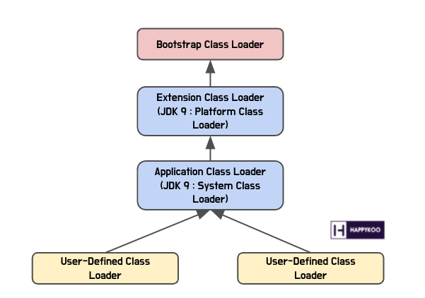

## 자바 코드가 실행되는 과정

### 전체적인 실행 과정
자바는 ```컴파일 타임 환경```과 ```런타임 환경```으로 나뉜다
1. .java 파일은 ```자바 컴파일러```에 의해 JVM이 이해할 수 있는 자바 바이트 코드(.class)파일로 컴파일 된다.

2. 컴파일된 파일들은 ```런타임 환경```에서 ```클래스 로더```에 의해 JVM의 메모리 영역에 로드되고 ```자바 인터프리터와 JIT 컴파일러```에 의해 해당 OS가 이해할 수 있는 기계어로 변환되어 실행된다

### 컴파일 타임 환경

```cmd
javac .java파일
```
위의 명령어를 통해 클래스 파일을 바이트 코드로 변환할 수 있다

> 이 바이트 코드는 실행 시점에 JVM에서 ```자바 인터프리터```에 의해 한줄한줄 기계어로 번역되어 실행된다

### 런타임 환경

* Class Loader
    ```cmd
    javac .java파일
    ```
    위의 명령을 실행하면 자바 바이트 코드를 JVM의 런타임 메모리 영역으로 올린다 

    * Bootstrap Class Loader
        * 다른 Class Loader들이 나머지 시스템이 필요한 클래스들을 로드할 수 있도록 최소한의 클래스들을 로드하는 역할을 한다

    * Extension Class Loader(JDK 9이상 Platform Class Loader)
        * java.ext.dir로 지정된 디렉토리에 위치한 확장 클래스들을 로드한다

    * Application Class Loader
        * 자바 ClassPath에 위치한 클래스나 .jar파일을 로드한다

    * User Defined Class Loader
        * 애플리케이션에서 개발자가 코드 상에서 직접 생성하여 사용하는 Class Loader이다

    * 
    > 그림과 같이 클래스 구조는 계층적으로 이루어져 있다. 클래스를 호출할때 서로 위임하는 구조이다.

* Excution Engine
    * 자바 인터프리터, JIT 컴파일러, Garbage Collector가 포함된다

    * 자바 인터프리터는 바이트코드를 한줄한줄 읽으며 OS환경에 맞는 기계어로 변역하는 역할을 한다 (한줄한줄 읽기 때문에 느림)
        * 이를 극복하기 위해 JIT 컴파일러 등장(그래도 느림)

    * JIT 컴파일러는 인터프리터를 사용했을 때의 속도를 보완하기 위해 등장했는데, 반복적으로 사용하는 기계어를 캐싱해놓고, 캐싱한 기계어를 사용하도록 한다. JVM은 자주 사용하는 코드를 확인 후 바이트 코드를 확인해 컴파일 후 캐싱한다.