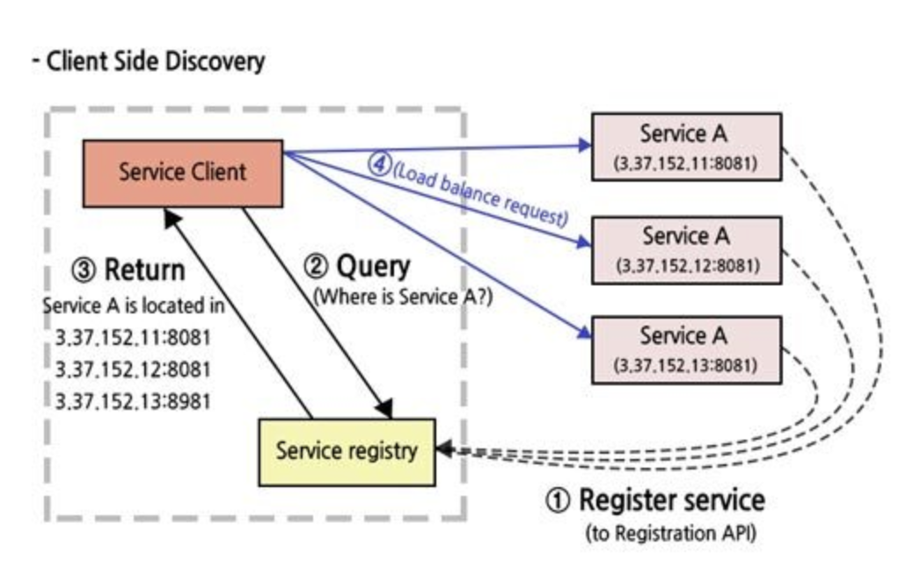
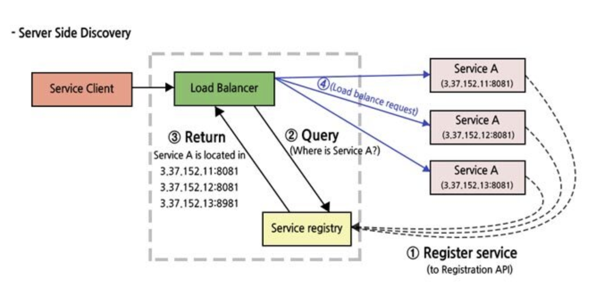

## 서비스 디스커버리
* 서비스 디스커버리란 MSA 환경에서 동적으로 바뀌는 서비스의 IP와 Port를 대신 찾아주는 기능이다

### 서비스 디스커버리의 종류
* 서비스 디스커버리는 Client Side Discovery 방식과 Server Side Discovery 방식으로 나뉘어진다
    * Client Side Discovery
        * 서비스의 인스턴스가 생성될 때 서비스의 주소를 서비스 레지스트리 서버에 등록해놓는다
        * 서비스 클라이언트가 서비스를 호출할 때 서비스 레지스트리 서버에 쿼리를 보내 저장된 주소를 통해 호출한다
        *
        * 서비스 인스턴스가 종료될 때 같이 삭제된다

    * Server Side Discovery
        * 호출되는 서비스 앞에 로드밸런서를 놓아 로드밸런서가 대신 레지스트리 서버에 저장된 주소를 호출하여 찾아준다
        * Server Side Discovery도 서비스 인스턴스가 종료될 대 같이 삭제된다
        * 

### Service Registry
* service discovery의 핵심 부분으로 서비스 인스턴스의 주소를 포함하는 데이테베이스이다 
* 높은 가용성과 최신성을 유지하여여 한다