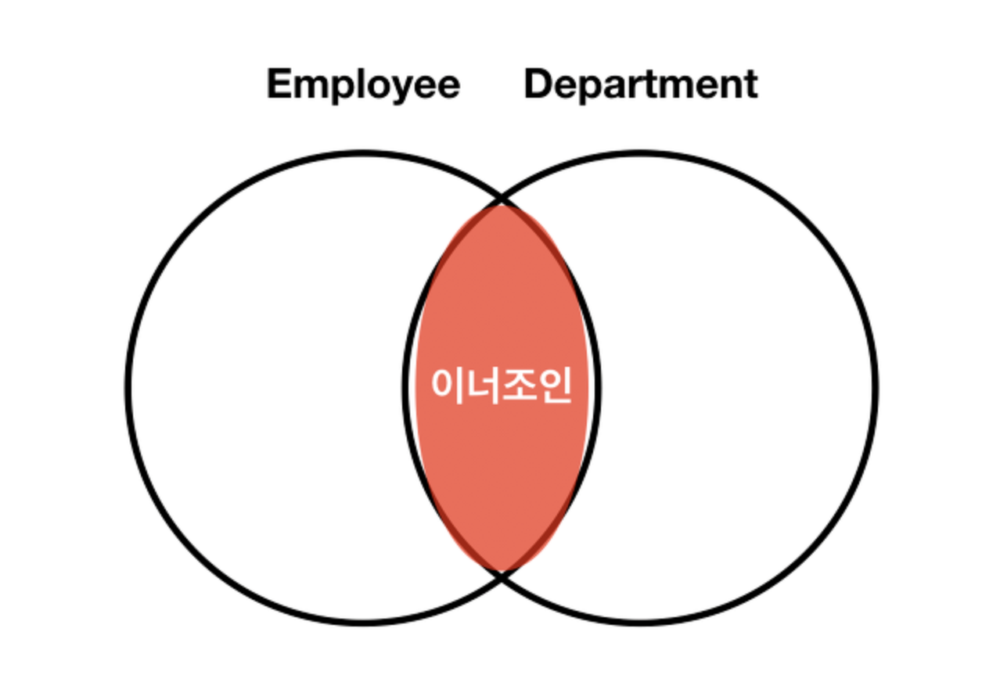
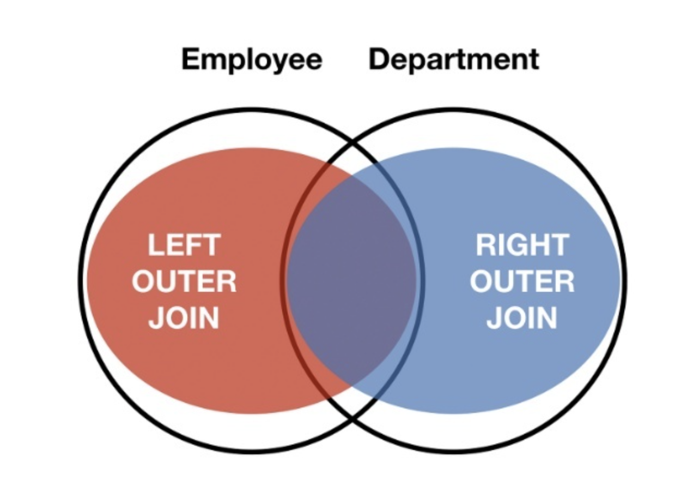

## Join이란
* 두개 이상의 테이블들을 연결 또는 결합하여 데이터를 출력하는 것이다
* 조인의 종류로는 크게 INNER, OUTER, CROSS, SELF 4가지가 있다
### INNER JOIN
* 두 개의 테이블에서 공통된 요소들을 결합하는 것이다 SQL에서 ```JOIN```이라는 키워드는 ```INNER JOIN```을 암묵적으로 뜻한다


* 예시 쿼리로는
    ```SQL
        SELECT table1.col1, table1.col2, table2.col1, table2.col2
        FROM table1 t1
        JOIN table2 t2 ON t1.col1 = t2.col1;
    ```
    작성할 수 있다

### OUTER JOIN
* 두 테이블에서 공통적인 컬럼과 한쪽 테이블의 컬럼들을 가져오는 ```JOIN```이다 ```OUTER JOIN```은 내부적으로 LEFT OUTER JOIN, RIGHT OUTER JOIN, 그 두개를 합친 JOIN으로 총 3가지가 존재한다


* 예시 쿼리로는
    ```SQL
        SELECT table1.co1, table1.col2, table2.col1, table2.col2
        FROM table1 t1
        LEFT/RIGHT(FULL) OUTER JOIN table2 t2 ON t1. col1 = t2.col1;
    ```
> 이때 ```LEFT```와 ```RIGHT```를 정하는 기준은 FROM절에 적은 테이블이 ```LEFT```, JOIN절에 적은 테이블이 ```RIGHT```가 된다

### CROSS JOIN
* 두 테이블간 가능한 모든 경우의 수를 결합하여 보여준다 모든 경우의 수를 결합하여 보여주기 때문에 ```ON```절을 사용하지 않아도 된다

* 예시 쿼리로는 
    ```SQL
        SELECT table1.co1, table1.col2, table2.col1, table2.col2
        FROM table1
        JOIN table2;
    ```

### SELF JOIN
* 자기 스스로를 결합시키는 ```JOIN```이며, ```JOIN```을 할 때 참조하는 테이블이 다른 테이블이 아닌 자기 자신이라는 것이 특징이다
* 주로 한 테이블 내에서 관련성이 존재하는 레코드들을 조인하여 데이터를 출력할 때 사용한다

* 예시 쿼리로는 
    ```SQL
        SELECT t1.col1, t2.col2
        FROM table1 t1
        JOIN table1 t2 ON t1.col1 = t2.col2;
    ```